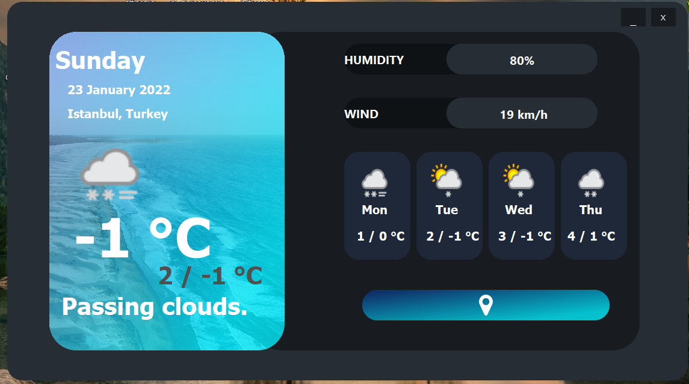

Modbus TCP web client.Allow you to easily write to and read from registers on a web server.

This is simple Web Scraping project using beautifulsoup4 and requests module.

Fetches the weather forcast based on the location (city) entered by the user.

[GitHub](https://github.com/selcukgk29/PySide2BeatifulSoupWebScrapping)