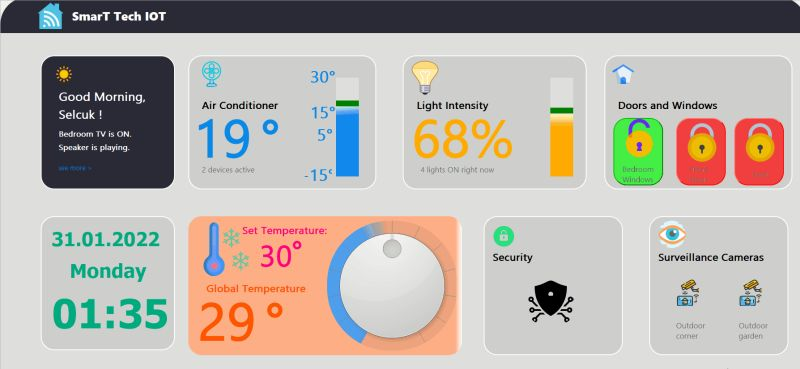

MQTT Smart Home Client GUI application that has been designed with PyQt5 to establish functions monitor.

SmarT TecH IOT Dashboard is MQTT client desktop application made using PyQT5 and paho-mqtt.You can control home temperature, swicthes and air conditioner. This will also run GUI application establish functions monitor.This Program to be designed consists of 2 components, namely Local MQTT Server, Fake temperature(mqtt.py) Node Client on a local network. Local MQTT Server to function as a server MQTT used between the Client for MQTT communication or place where the function "publish" and "subscribe" to be processed and regulated by the Server MQTT.

[GitHub](https://github.com/selcukgk29/A-MQTT-client-with-PyQt5-PSide2)