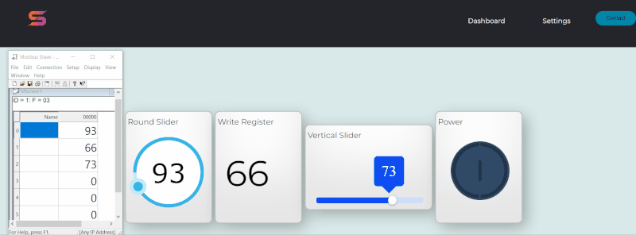

A Modbus TCP web client facilitates easy communication with Modbus TCP servers, enabling seamless reading from and writing to registers. This application is commonly used in industrial automation, energy management, building automation, and IoT sectors for efficient data exchange and control.

[GitHub](https://github.com/selcukgk29/modbus-tcp-web-client)