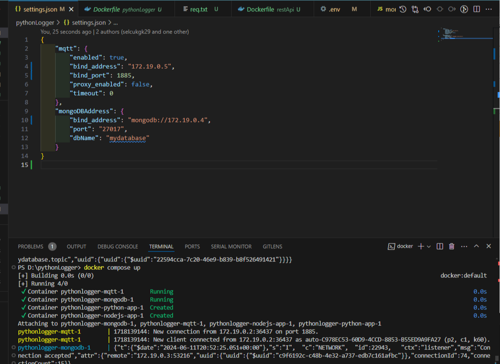

Bu Dockerize edilmiş MQTT protokol logger uygulaması, 4 adet Docker container'ından oluşmaktadır: Python logger servisi, Node.js REST API servisi, Mosquitto MQTT brokeri ve MongoDB sunucusu. Uygulamanın çalışma mantığı şu şekildedir:

<!-- truncate -->

**Python Logger Servisi:**

Başlangıçta çalışarak MQTT brokerına ve MongoDB sunucusuna bağlanır.
MQTT brokerı üzerinde oluşmuş tüm topic'leri dinler.
Herhangi bir MQTT topic'ine yeni veri ulaştığında, bu topic adında bir MongoDB koleksiyonu oluşturur.
Verileri ilgili koleksiyon içine yazarak MongoDB'ye kaydeder.


**Mosquitto MQTT Broker:**

MQTT istemcileri ve Python logger servisi arasında mesajlaşma sağlar.
Belirli bir MQTT topic'ine abone olan istemcilere mesajları iletebilir.


**MongoDB Sunucusu:**

Veritabanı olarak kullanılır.
Python logger servisinin aldığı MQTT verilerini saklamak için kullanılır.
Her MQTT topic'i için ayrı bir MongoDB koleksiyonu oluşturur ve bu koleksiyonlara veri kaydeder.


**Node.js REST API Servisi:**

MongoDB sunucusundaki verilere erişim sağlamak ve istemcilere HTTP API üzerinden veri sunmak için kullanılır.
İstemcilerin MongoDB'deki verilere erişmesine, veri eklemesine veya güncellemesine izin veren HTTP endpoint'leri sunar.

Node.js REST API servisi, istemcilerin MongoDB sunucusundaki verilere HTTP API üzerinden erişmesine olanak tanır. REST API servisinize gelen isteklerin kimlik doğrulaması için Bearer token gereklidir.Login requestinin response unda bu token bulunur.Aşağıda belirtilen HTTP endpoint'leri sağlar:

### `/user/login`

- **Açıklama**: Kullanıcı girişi için POST isteği alır.
- **Örnek İstek**:

  ```json
  POST http://localhost:5000/user/login

  {
    "email": "asd@asd.com",
    "password": "123456"
  }
  ```

### `/getAll`

- **Açıklama**: Belirtilen koleksiyondaki tüm belgeleri almak için GET isteği alır.
- **Örnek İstek**:

  ```json
  GET http://localhost:5000/getAll

  {
    "request": {
      "type": "GET",
      "method": "getAll",
      "url": "http://localhost:3000/getAll",
      "body": {
        "message": "Please choose collection",
        "collections": [
          "users",
          "testtopic0"
        ]
      }
    }
  }
  ```

### `/getAll/testtopic0`

- **Açıklama**: `testtopic0` koleksiyonundaki belgeleri almak için GET isteği alır.
- **Örnek İstek**:

  ```json
  GET http://localhost:5000/getAll/testtopic0

  {
    "request": {
      "type": "GET",
      "url": "http://localhost:3000/getAll/testtopic0",
      "body": {
        "message": "Response is coming from testtopic0 collection",
        "values": [
          {
            "_id": "6668b9d26379a9f6d0d75288",
            "topic": "testtopic0",
            "payload": [
              {
                "testkey": "560,456"
              }
            ],
            "time": 1718139346167
          },
          {
            "_id": "6668ba076379a9f6d0d7528a",
            "topic": "testtopic0",
            "payload": [
              {
                "testkey": "460,456"
              }
            ],
            "time": 1718139399258
          },
          {
            "_id": "6668ba0e6379a9f6d0d7528c",
            "topic": "testtopic0",
            "payload": [
              {
                "testkey": "460,456"
              }
            ],
            "time": 1718139406714
          },
          {
            "_id": "6668ba126379a9f6d0d7528e",
            "topic": "testtopic0",
            "payload": [
              {
                "testkey": "480,456"
              }
            ],
            "time": 1718139410901
          },
          {
            "_id": "6668ba176379a9f6d0d75290",
            "topic": "testtopic0",
            "payload": [
              {
                "testkey": "489,456"
              }
            ],
            "time": 1718139415455
          }
        ]
      }
    }
  }
  ```

### `/getByDate/testtopic0/from=<starttimestamp>/to=<endtimestamp>`

- **Açıklama**: Belirtilen zaman aralığı içindeki `testtopic0` koleksiyonundaki belgeleri almak için GET isteği alır.
- **Örnek İstek**:

  ```json
  GET http://localhost:5000/getByDate/testtopic0/from=1718139346167/to=1718139415455
  ```

Bu endpoint'ler, istemcilere belirli koleksiyonlardaki verilere erişme ve işlemler yapma imkanı sağlar. MongoDB veritabanınızda ilgili koleksiyonların ve istemci isteklerinin doğru şekilde yönlendirilmesini sağlamak için bu örnekler üzerinden ilerleyebilirsiniz.
