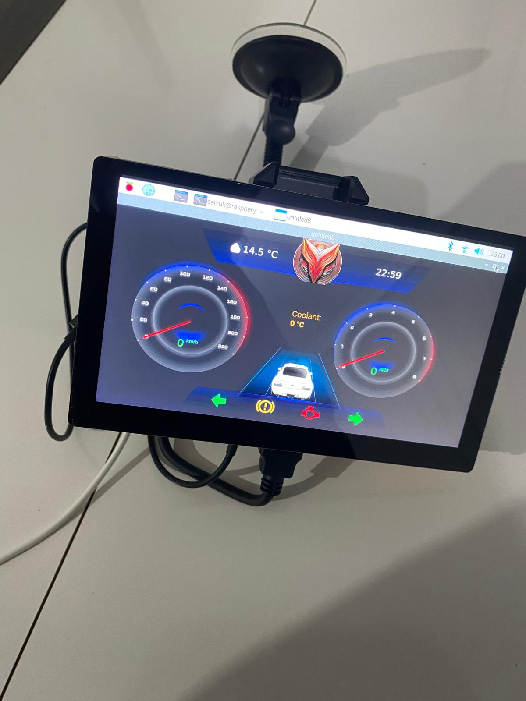

ELM327-based Bluetooth OBD-II-CAN reader.
<!-- truncate -->

**Overview**

I've been working on a digital cluster for my car, utilizing an ELM327-based Bluetooth OBD-II Bluetooth reader. This module is widely available online and operates using AT commands to retrieve CAN frames and device configurations. While it's an affordable option, it comes with certain limitations.

For instance, I can only monitor specific CAN messages rather than the entire data stream, which I would prefer. This necessitates periodically sending requests for data and parsing the output, which can significantly impact performance. Additionally, the ELM327 module sometimes struggles with timely data transmission.

In the future, I plan to enhance the system by replacing the ELM327 with high-speed USB2CAN converters, allowing for more efficient data handling and broader access to CAN messages.

